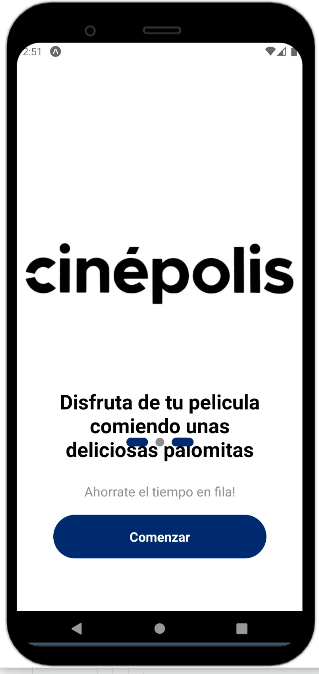
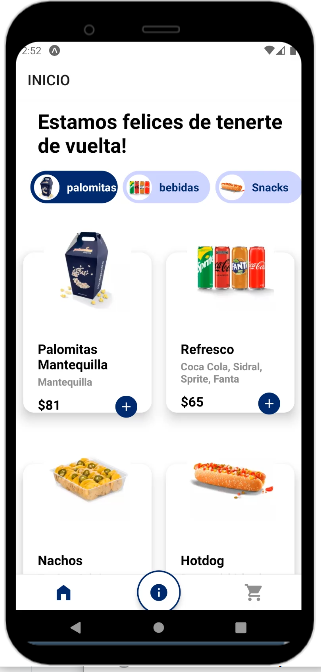
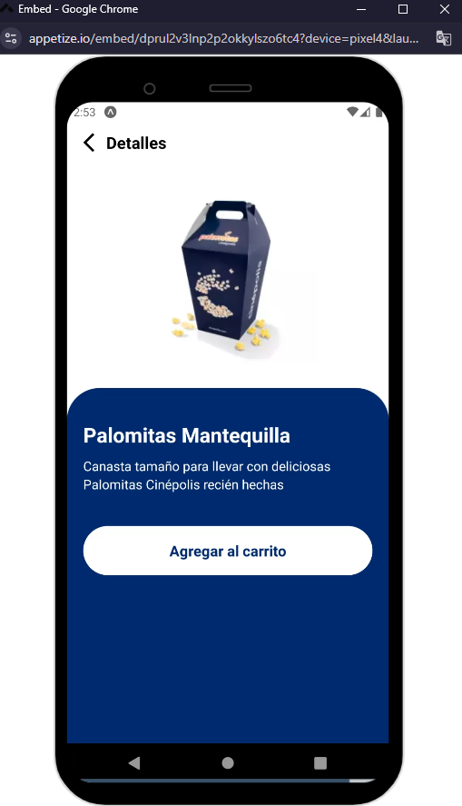
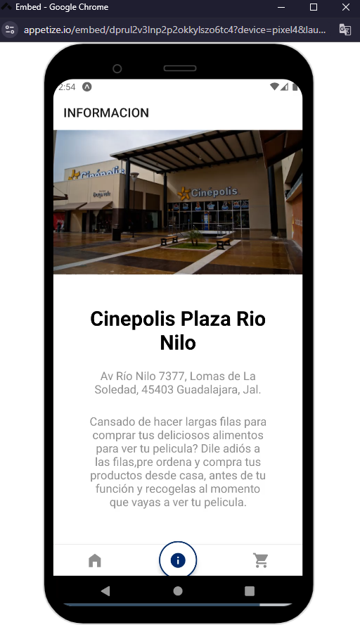

# Sample Snack app

The app presents an idea aimed at solving a problem identified in the past, related to people spending long periods of time in queues. It offers a simple solution by allowing customers to order snacks online, where they only need to pick up their order.

  
  

  
  

The project was developed on the Expo Go web platform, leveraging the phone simulator.

